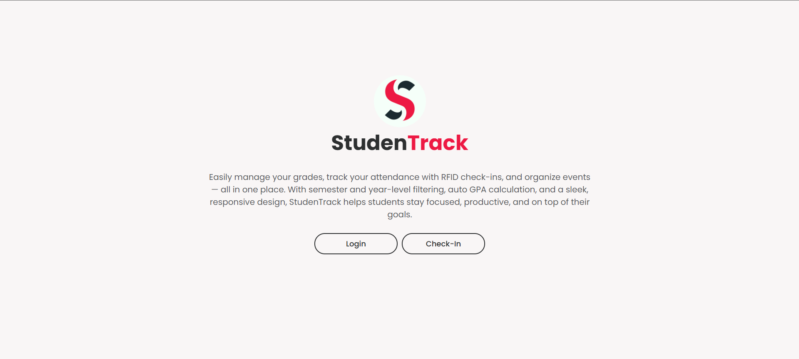

# 🎓 StudentTrack: Your All-in-One Academic Companion



> **Streamline your academic life** with smart grade tracking, RFID attendance, and event management — all in one intuitive platform.

## ✨ Why StudentTrack?

- 📈 **Automated GPA Calculation** - Never manually calculate your grades again
- 📲 **RFID-Powered Attendance** - Just tap to check-in (no duplicate entries)
- 🗓️ **Smart Academic Calendar** - Visualize your schedule with FullCalendar
- 🎯 **Personalized Dashboard** - See everything that matters at a glance
- 🔒 **100% Offline Privacy** - All data stays securely in your browser

## 🛠️ Tech Stack

| Frontend                                                                                                          | Libraries                                                                                                           | Storage                                                                                             | Version Control                                                                                       |
| ----------------------------------------------------------------------------------------------------------------- | ------------------------------------------------------------------------------------------------------------------- | --------------------------------------------------------------------------------------------------- | ----------------------------------------------------------------------------------------------------- |
|                 |       |  |           |
|                    |  |                                                                                                     |  |
|  |                                                                                                                     |                                                                                                     |                                                                                                       |

## 🔥 Key Features

### 📊 Academic Management

- **Smart GPA Calculator** - Automatically updates as you add grades
- **Semester Filtering** - View data by year level (1st-4th year) and semester
- **Subject Organizer** - Add/edit/delete courses with credit units

### 🚀 Productivity Boosters

- **One-Tap Attendance** - RFID prevents duplicate daily check-ins
- **Auto-Absence Detection** - Flags missed days after 24 hours
- **Event Scheduler** - Color-coded academic events with reminders

### 🔒 User Experience

- **Persistent Sessions** - Stay logged in across visits
- **Responsive Design** - Works flawlessly on all devices
- **Data Privacy** - Everything stays in your browser (no cloud storage)

## 📄 Pages

- 🔐 **Authentication System**

  - Email & password login
  - Duplicate email check
  - Local user session tracking

- 🎯 **Dashboard Summary**

  - Personalized greeting
  - Subject count, GPA, check-ins
  - Filters by selected semester/year

- 📊 **Grades Manager**

  - Add/Edit/Delete subjects with grades
  - GPA auto-calculation
  - Filterable per year and semester

- 📅 **Attendance System**

  - RFID check-in (one check-in per day)
  - Calendar view of logs
  - Absent if not checked in in 24 hours

- 🗓️ **Event Scheduler**

  - Add, edit, delete academic events
  - View via interactive FullCalendar
  - Filtered by year & semester

- ⚙️ **Settings**
  - Edit name, email, RFID
  - Change year & semester
  - Delete account (clears all user data)

## 🖥️ System Architecture

```plaintext
StudentTrack/
├──  assets/
│   ├──  css/              # All styling
│   ├──  js/               # Modular JavaScript components
│   │   ├── attendance.js  # RFID check-in logic
│   │   ├── dashboard.js   # Summary statistics
│   │   └── ...            # 6 other specialized modules
│   ├──  pages/            # All HTML views
│   └──  img/              # Assets and screenshots
├──  index.html            # Landing page
└──  README.md             # This documentation
```

## 🌐 Live Site

🔗 **[GitHub Pages Preview](https://binibiningjenna.github.io/studenTrack/)**

## ⚡ Getting Started

1. **Clone the repository**

   ```bash
   git clone https://github.com/binibiningjenna/studenTrack.git
   cd studenTrack
   ```

## 📬 Get in Touch

```plaintext
------------------------------------------
  Have questions or suggestions?
  I'd love to hear from you!

  📧 Email: atienzajennamiles@gmail.com
  🐱 GitHub: @binibiningjenna
  💡 Feature Requests: Open GitHub Issue
------------------------------------------
```
